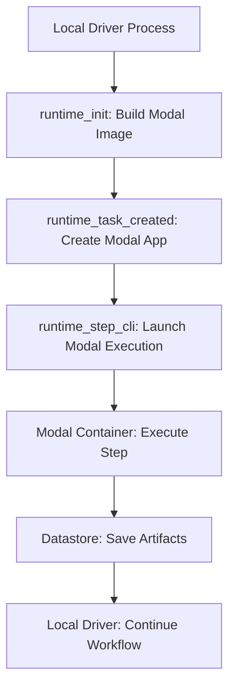

# Modal Metaflow Integration Specification

## Overview

The Modal Metaflow integration enables Metaflow workflows to execute steps on Modal's serverless infrastructure using a `@modal` decorator. This integration provides seamless cloud execution while maintaining Metaflow's local development experience and artifact management.

## Architecture

### Core Design Principles

1. **Native Metaflow Integration**: The `@modal` decorator follows Metaflow's `StepDecorator` pattern and integrates seamlessly with existing decorators
2. **Programmatic Modal API**: Uses Modal's Python SDK directly without CLI dependencies
3. **Ephemeral Execution**: Creates Modal apps per Metaflow run for isolation and cleanup
4. **Artifact Continuity**: Preserves Metaflow's datastore and artifact management across local/remote execution

### Execution Model

- **Driver Process**: Remains local and coordinates the workflow
- **Remote Steps**: Execute on Modal containers with full Metaflow runtime
- **Artifact Flow**: Seamless data persistence through Metaflow's datastore
- **Package Management**: Code packages uploaded once per run and distributed to Modal containers

## User API

### Basic Usage

```python
from metaflow import FlowSpec, step
from modal_metaflow import modal

class MyFlow(FlowSpec):

    @step
    def start(self):
        self.data = [1, 2, 3, 4, 5]
        self.next(self.process)

    @modal()
    @step
    def process(self):
        # This step runs on Modal
        self.result = [x * 2 for x in self.data]
        self.next(self.end)

    @step
    def end(self):
        print(f"Result: {self.result}")  # [2, 4, 6, 8, 10]
```

### Resource Configuration

```python
@modal(cpu=4, memory=8192, gpu="H100:1")
@step
def compute_step(self):
    # Runs on Modal with 4 CPUs, 8GB RAM, 1 H100 GPU
    pass

@modal(cpu=4)
@resources(cpu=2, memory=4096, gpu=1)
@step
def hybrid_step(self):
    # Takes maximum of both configurations
    # Results in: 4 CPU, 4096 memory, 1 H100 (default gpu type,
    # pass to @modal if you want it configured)
    pass
```

### Environment and Dependencies

Simple dependencies can be configured the normal way, e.g. via `@pypi`.
```python
@modal()
@environment(vars={"SUPER_PANDAS": "1", "DEBUG": "true"})
@pypi(packages={"numpy": "1.24.0", "pandas": "2.0.0"}, python="3.11")
@step
def data_step(self):
    # Runs with custom environment and packages
    import numpy as np
    import pandas as pd
    if int(os.environ["SUPER_PANDAS"]):
        pd.boost()
```

Complex dependencies are better suited for a Modal Image:
```python
from metaflow import step, FlowSpec
from modal import Image
from modal_metaflow import modal

trtllm_image = (
    Image.from_registry(f"nvidia/cuda:12.8.1-devel-ubuntu24.04", add_python="3.12")
        .entrypoint([])  # remove verbose logging by base image on entry
        .apt_install("libopenmpi-dev")  # required for tensorrt
        .uv_pip_install("tensorrt-llm==0.19.0", "pynvml", extra_index_url="https://pypi.nvidia.com")
        .uv_pip_install("hf-transfer", "huggingface_hub[hf_xet]")
        .env({"HF_HUB_ENABLE_HF_TRANSFER": "1", "PMIX_MCA_gds": "hash"})
    )

with trtllm_image.imports():
    from tensorrt_llm import LLM, SamplingParams

class ComplexFlow(FlowSpec):
    ...

    @modal(image=trtllm_image, gpu="B200")
    def run_inference(self):
        sampling_params = SamplingParams(temperature=0.8, top_p=0.95)

        llm = LLM(model="TinyLlama/TinyLlama-1.1B-Chat-v1.0")

        output = llm.generate("The capital of France is", sampling_params)
        self.completion = output.outputs[0].text
        self.next(...)

```

### Error Handling and Retries

```python
@modal()
@retry(times=3, minutes_between_retries=2)
@timeout(hours=1)
@step
def robust_step(self):
    # Modal execution with Metaflow retry/timeout handling
    pass
```

## Configuration Options

### Modal Decorator Parameters

| Parameter | Type | Description | Default |
|-----------|------|-------------|---------|
| `cpu` | `float` | Number of CPU cores | `None` |
| `memory` | `int` | Memory in MB | `None` |
| `gpu` | `str\|list` | GPU specification (e.g., "H100:2") | `None` |
| `image` | `modal.Image` | Custom base image | `None` |
| `ephemeral_disk` | `int` | Disk space in GB | `None` |
| `timeout` | `int` | Timeout in seconds | `None` |
| `retries` | `modal.Retries` | Modal retry configuration | `None` |

### GPU Configuration

GPU specifications follow Modal's format:
- `"H100:1"` - Single H100 GPU
- `"A100:2"` - Two A100 GPUs
- `"T4:4"` - Four T4 GPUs
- `["H100", "A100"]` - Complex multi-GPU configurations

### Resource Resolution

When both `@modal` and `@resources` specify the same resource:
- **CPU/Memory/Disk**: Maximum value is used
- **GPU**: Modal decorator takes precedence with warning
- **Timeout**: Modal decorator takes precedence

## Integration with Metaflow Decorators

### Supported Decorators

- ✅ `@resources` - Resource allocation (CPU, memory, GPU, disk)
- ✅ `@environment` - Environment variables
- ✅ `@pypi` - Python package dependencies
- ✅ `@retry` - Retry configuration
- ✅ `@timeout` - Execution timeout

### Incompatible Decorators

- ❌ `@batch` - Mutually exclusive (AWS Batch vs Modal)
- ❌ `@kubernetes` - Mutually exclusive (K8s vs Modal)

### Decorator Processing Order

1. **Step Initialization**: Parse all decorators and extract configuration
2. **Resource Resolution**: Merge `@modal` and `@resources` specifications
3. **Environment Setup**: Combine `@environment` and `@pypi` requirements
4. **Modal Image Building**: Create container image with all dependencies
5. **Remote Execution**: Deploy and execute on Modal infrastructure

## Execution Lifecycle

### Runtime Flow



### Modal Infrastructure Management

1. **Image Building**: Build `modal.Image` once per run with all dependencies and user code
2. **App Creation**: Ephemeral Modal app per Metaflow run
3. **Function Definition**: Step-specific Modal function with resource config
4. **Execution**: Programmatic function invocation via `.remote()` or `.spawn()`
5. **Cleanup**: Automatic Modal app cleanup on workflow completion

### Dependency and Code Management

Each Metaflow run builds exactly one `modal.Image` that contains:
- **User Code**: Added with `image.add_local_dir()`
- **Python Dependencies**: Collected from all `@pypi`, `@conda` decorators
- **System Commands**: Any custom shell/apt commands via `image.run_commands()`

The image is cached in Modal's registry and reused by every step in that run (and across runs if layer hashes are unchanged). No separate "code package" is uploaded to the Metaflow datastore.

## Error Handling

### Retry Mechanism

Modal retry configuration is derived from `@retry` decorator:
```python
@retry(times=3, minutes_between_retries=5)
# Becomes: modal.Retries(max_retries=3, initial_delay=300, backoff_coefficient=1.0)
```

### Timeout Handling

Combined timeout from `@timeout` decorator:
```python
@timeout(hours=2, minutes=30)
# Becomes: timeout=9000 (seconds)
```

### Failure Recovery

- **Modal Function Failure**: Propagated to Metaflow runtime
- **Network Issues**: Handled by Modal SDK retry mechanisms
- **Resource Unavailability**: Modal queuing and auto-scaling
- **Package Access**: Retry package download with exponential backoff

## Security and Credentials

### Datastore Access

Modal containers access Metaflow's datastore through `modal.CloudBucketMount`:

```python
@modal()
@step
def datastore_step(self):
    # S3/GCS datastore mounted at /metaflow_datastore
    pass
```

**Supported Clouds:**
- **S3 & Cloudflare R2**: Full support with OIDC or access key authentication
- **GCS**: S3-compatible via HMAC keys
- **Azure**: Not yet supported by CloudBucketMount - use environment credentials

**Limitations:**
- Optimized for sequential reads; poor random access performance
- Write operations limited (no append mode, no arbitrary offset writes)
- Treat datastore as append-only for best performance

**Future Enhancement:** Modal Volume-backed datastore for low-latency, high-QPS workloads (<50K files).

### Secrets Management

```python
# Metaflow secrets automatically mapped to Modal
@modal()
@secrets(vars={"DATABASE_URL": "prod-db"})
@step
def secure_step(self):
    import os
    db_url = os.environ["DATABASE_URL"]  # Available in Modal container
```

### Network Security

- Modal containers run in isolated environments
- Outbound internet access for package downloads
- Datastore access via secure endpoints
- Optional VPC integration for enterprise deployments

## Performance Considerations

### Cold Start Optimization

- **Image Layer Caching**: Modal caches image layers across runs when unchanged
- **Dependency Caching**: Python packages cached in Modal image layers
- **Warm Containers**: Modal maintains warm container pools

### Scalability

- **Parallel Steps**: Each `@modal` step gets independent Modal container
- **Resource Isolation**: Steps don't compete for local resources
- **Auto-scaling**: Modal handles container provisioning automatically

### Cost Optimization

- **Ephemeral Apps**: No persistent Modal infrastructure costs
- **Resource Matching**: Precise resource allocation per step
- **Spot Instances**: Modal handles spot instance management

## Development and Testing

### Execution Model

**All** `@modal` steps execute remotely on Modal infrastructure. Local simulation is out of scope. Users requiring local development can use standard Metaflow decorators or leverage Modal's development tooling (`modal serve`, `modal shell`).

### Debugging

- **Modal Logs**: Streamed to local console during execution
- **Metaflow Metadata**: Modal execution details stored in metadata
- **Error Propagation**: Modal errors surface in Metaflow logs
- **Resume Support**: Failed runs can resume from successful steps

## Examples

### Axolotl Finetuning + Inference
```python
import sys
from modal import Image

python_version=f"{sys.version_info.major}.{sys.version_info.minor}"
axolotl_image = (
    modal.Image.debian_slim(python=python_version)
        .uv_pip_install("axolotl==0.11.0", extra_options="--torch-backend=cu128")
)

with axolotl_image.imports():
    from axolotl.cli.config import load_cfg
    from axolotl.common.datasets import load_datasets
    from axolotl.train import train

class AxolotlPipeline(FlowSpec):
    @step
    def start(self):
        self.data_path = "s3://bucket/dataset.jsonl"
        self.config_path = "s3://bucket/qwen3_lora_64.yml"
        # or "~/path/to/local_repo/qwen3_lora_64.yml", etc.
        self.next(self.preprocess)

    @modal(image=axolotl_image)
    @step
    def train(self):
        cfg = load_cfg(self.config_path, datasets=[
            {
                "path": self.data_path,
                "type": "chat_template",
                "split": "train",
                "eot_tokens": ["<|im_end|>"],
            }
        ])
        dataset_meta = load_datasets(cfg=cfg)
        cfg.max_steps = 25  # demo
        self.model, self.tokenizer, trainer = train(cfg=cfg, dataset_meta=dataset_meta)
        self.next(self.inference)

    @modal(image=axolotl_image)
    @step
    def inference(self):
        messages = [
            {
                "role": "user",
                "content": "Explain the Pythagorean theorem to me.",
            },
        ]

        prompt = tokenizer.apply_chat_template(
            messages,
            add_generation_prompt=True,
            tokenize=False,
            enable_thinking = False,
        )

        outputs = model.generate(
            **tokenizer(prompt, return_tensors = "pt").to("cuda"),
            max_new_tokens = 192,
            temperature = 1.0, top_p = 0.8, top_k = 32,
            streamer = TextStreamer(tokenizer, skip_prompt = True),
        )
```


### Machine Learning Pipeline

```python
class MLPipeline(FlowSpec):

    @step
    def start(self):
        self.data_path = "s3://bucket/dataset.csv"
        self.next(self.preprocess)

    @modal(cpu=4, memory=8192)
    @pypi(packages={"pandas": "2.0.0", "scikit-learn": "1.3.0"})
    @step
    def preprocess(self):
        import pandas as pd
        # Heavy preprocessing on Modal
        self.features = "processed_features.pkl"
        self.next(self.train)

    @modal(gpu="H100:1", memory=16384)
    @pypi(packages={"torch": "2.0.0", "transformers": "4.30.0"})
    @retry(times=2)
    @timeout(hours=4)
    @step
    def train(self):
        import torch
        # GPU training on Modal
        self.model_path = "trained_model.pt"
        self.next(self.evaluate)

    @modal(cpu=2)
    @step
    def evaluate(self):
        # Evaluation on Modal
        self.metrics = {"accuracy": 0.95}
        self.next(self.end)

    @step
    def end(self):
        print(f"Model trained with accuracy: {self.metrics['accuracy']}")
```

### Data Processing Pipeline

```python
class DataPipeline(FlowSpec):

    data_sources = Parameter("sources", default="source1,source2,source3")

    @step
    def start(self):
        self.sources = self.data_sources.split(",")
        self.next(self.process, foreach="sources")

    @modal(cpu=8, memory=16384, ephemeral_disk=100)
    @environment(vars={"WORKER_TYPE": "data_processor"})
    @pypi(packages={"dask": "2023.5.0", "pyarrow": "12.0.0"})
    @retry(times=3, minutes_between_retries=1)
    @step
    def process(self):
        import dask.dataframe as dd
        # Parallel data processing on Modal
        source = self.input
        self.processed_data = f"processed_{source}.parquet"
        self.record_count = 1000000
        self.next(self.join)

    @step
    def join(self, inputs):
        self.total_records = sum(inp.record_count for inp in inputs)
        self.next(self.end)

    @step
    def end(self):
        print(f"Processed {self.total_records} total records")
```

## Migration Guide

### From @kubernetes Decorator

```python
# Before: Kubernetes
@kubernetes(cpu=2, memory=4096, image="my-image:latest")
@step
def k8s_step(self):
    pass

# After: Modal
# ECR-permissioned secret
# TODO: use OIDC-provisioned secret for ECR auth
aws_secret = modal.Secret.from_local_environ(["AWS_ACCESS_KEY_ID", "AWS_SECRET_ACCESS_KEY", "AWS_REGION"])
custom_image = Image.from_aws_ecr(
    "000000000000.dkr.ecr.us-east-1.amazonaws.com/my-private-registry:latest",
    secret=aws_secret,
)

@modal(cpu=2, memory=4096, image=custom_image)
@step
def modal_step_with_prebuilt(self):
    pass
```

<!--### From @batch Decorator

```python
# Before: AWS Batch
@batch(cpu=4, memory=8192, queue="ml-queue")
@step
def compute_step(self):
    pass

# After: Modal
@modal(cpu=4, memory=8192)
@step
def compute_step(self):
    pass
```-->

## Limitations and Constraints

### Future Enhancements

- **Conda Integration**: Full conda environment support
- **UV Integration**: Full uv environment support
- **Volume Mounting**: modal.Volume-backed Metaflow datastore
